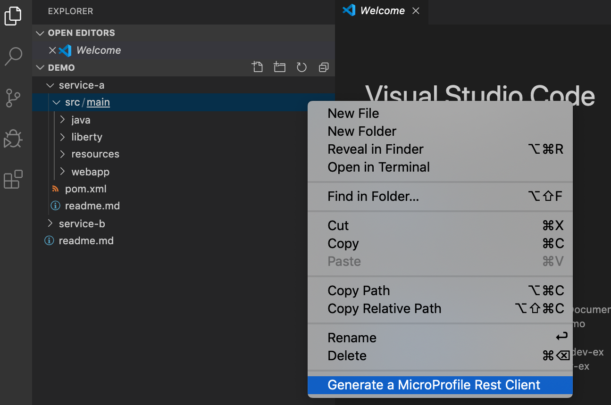

# Generator for MicroProfile Rest Client
The Generator for MicroProfile Rest Client extension provides support for generating a [MicroProfile](https://microprofile.io/) REST Client interface template from an [OpenAPI](https://github.com/OAI/OpenAPI-Specification) document in Visual Studio Code. This extension calls the [openapi-generator](https://github.com/OpenAPITools/openapi-generator) to generate `models` and `apis` folders. The code for this extension is hosted under the MicroShed organization on GitHub. Learn more about MicroProfile Rest Client on [GitHub](https://github.com/eclipse/microprofile-rest-client).

## Quick Start

- Install the extension
- Launch the VS Code command palette `(View -> Command Palette...)`, then select `MicroProfile: Generate a MicroProfile REST Client` to run the extension

## Input

The extension prompts for the following parameters:

1. Path or url to an OpenAPI document
2. `src` directory of project to generate into
3. Package name

The extension will generate `models` and `apis` folders into the specified directory. The package name will be auto-filled based on the directory generated into.

## Contributing

Contributions to the Generator for MicroProfile Rest Client extension are welcome!

Our [CONTRIBUTING](CONTRIBUTING.md) document contains details for submitting pull requests.

To build and run the extension locally:

1. [Fork](https://docs.github.com/en/free-pro-team@latest/github/getting-started-with-github/fork-a-repo) this repository
2. Clone your fork: `git clone git@github.com:{your-username}/mp-rest-client-generator-vscode-ext.git`
3. `cd mp-rest-client-generator-vscode-ext`
4. Create a branch for the issue you are going to work on: `git checkout -b branch-name-for-your-issue`
5. Install dependencies: `npm install` and `npx openapi-generator-cli version`
6. Run the extension in VS Code by selecting `Run Extension` from the debug panel or by pressing `F5`

   Alternatively, build a `.vsix` file:

   - Run `vsce package` to generate the `mp-rest-client-generator-vscode-ext-xxx.vsix` file
   - Install the extension to VS Code by `View/Command Palette`
   - Select `Extensions: Install from VSIX...` and choose the generated `mp-rest-client-generator-vscode-ext-xxx.vsix` file

7. Generate a REST client by right-clicking on a folder and selecting "Generate a MicroProfile REST Client", or via the command palette by selecting "MicroProfile: Generate a MicroProfile REST Client"

## Issues

Please report bugs, issues and feature requests by creating a [GitHub issue](https://github.com/MicroShed/mp-rest-client-generator-vscode-ext/issues).

MicroProfile&reg; and the MicroProfile logo are trademarks of the Eclipse Foundation.
